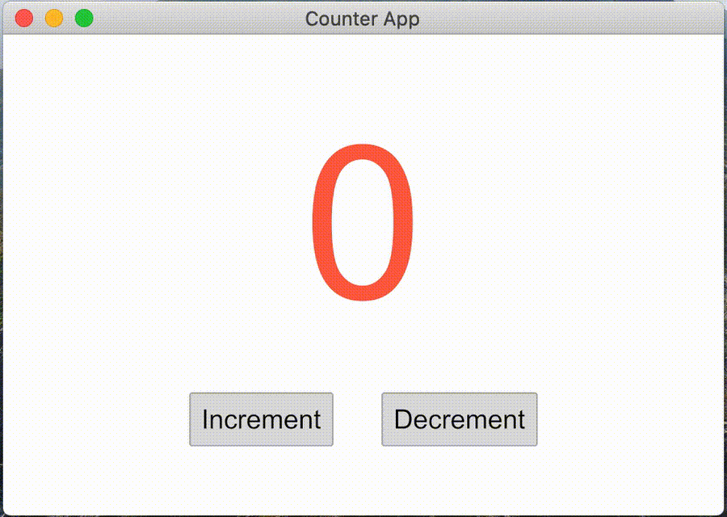
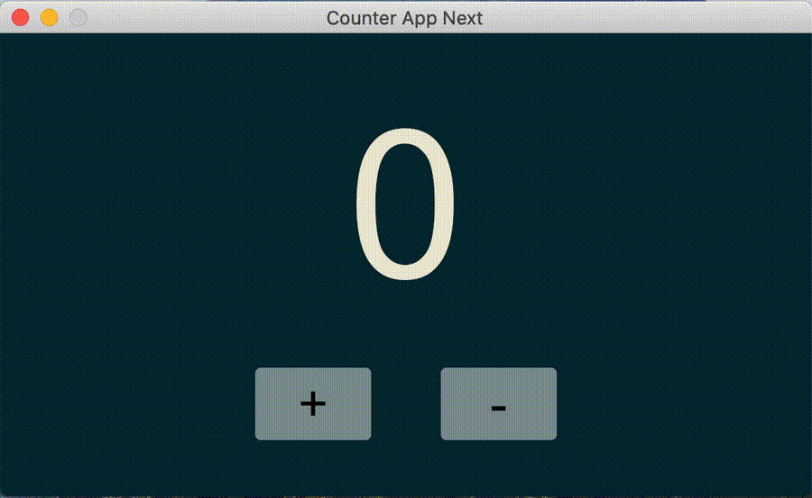
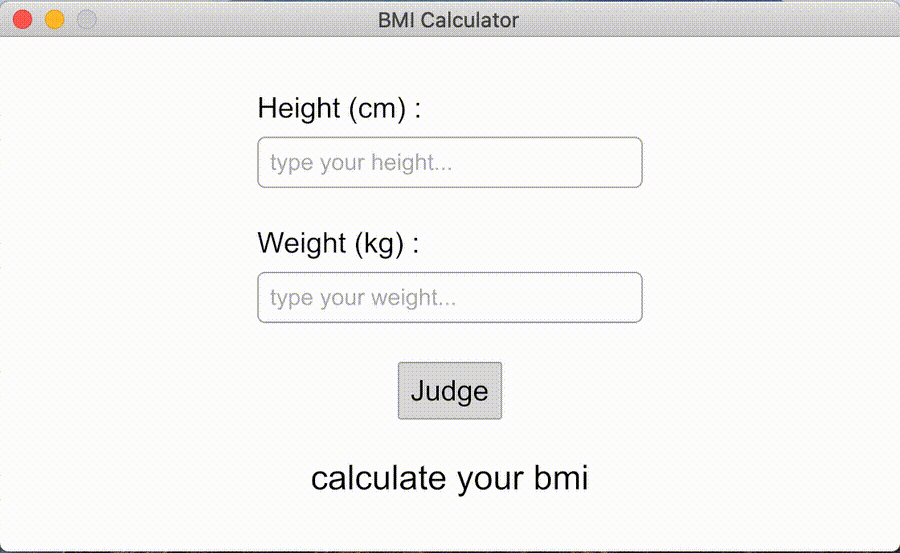
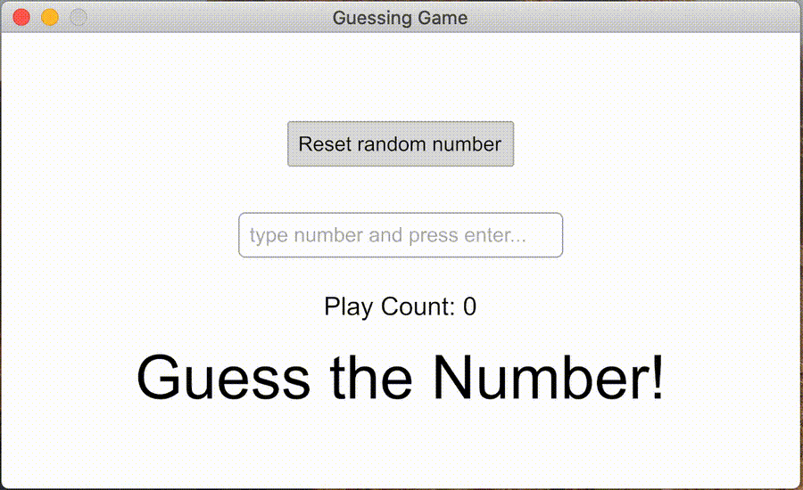

# iced_practice
icedで作ったものをまとめていきたいと思います。

# how to use 

```terminal
hibi221b@hibi221b-2 Desktop % git clone https://github.com/hibi221b/iced_practice.git

hibi221b@hibi221b-2 Desktop % cd iced_practice

hibi221b@hibi221b-2 iced_practice % ls
Cargo.lock	Cargo.toml	LICENSE		README.md	sandbox		target

hibi221b@hibi221b-2 iced_practice % cd sandbox 

hibi221b@hibi221b-2 sandbox % ls
counter

hibi221b@hibi221b-2 sandbox % cargo run -p counter
```

# contents

|[counter](https://github.com/hibi221b/iced_practice/tree/master/sandbox/counter)|[counter_next](https://github.com/hibi221b/iced_practice/tree/master/sandbox/counter_next)|[bmi_calc](https://github.com/hibi221b/iced_practice/tree/master/sandbox/bmi_calc)|
|:---:|:---:|:---:|
||||

|[guessing_game](https://github.com/hibi221b/iced_practice/tree/master/sandbox/guessing_game)|[img_viewer](https://github.com/hibi221b/iced_practice/tree/master/sandbox/img_viewer)|[lang_ja](https://github.com/hibi221b/iced_practice/tree/master/sandbox/lang_ja)|
|:---:|:---:|:---:|
||||

# news

- Rust 2021: GUI <br>
https://raphlinus.github.io/rust/druid/2020/09/28/rust-2021.html

- Sponsoring development of Rust GUI library iced (Cryptowatch blog) <br>
https://blog.cryptowat.ch/sponsoring-rust-gui-library-iced/

# helpful links

- iced zulip chat <br>
https://iced.zulipchat.com/

- Rustで書かれたGUIライブラリーのicedを試してみた <br>
https://hnakamur.github.io/blog/2020/08/11/tried-rust-gui-library-iced/

- Rust GUI crate調査: iced <br>
https://toyamaguchi.hatenablog.com/entry/2020/03/31/233000

# github 

- iced公式examples <br>
https://github.com/hecrj/iced/tree/master/examples

- Project Showcase #355 <br>
https://github.com/hecrj/iced/issues/355

- An extension to the Iced GUI library with useful widgets for audio applications <br>
https://github.com/BillyDM/iced_audio

- 実践Rustプログラミング入門Chapter7 GUIアプリケーション <br>
https://github.com/forcia/rustbook/tree/master/ch07

- Ludusavi is a tool for backing up your PC video game save data, written in Rust. <br>
https://github.com/mtkennerly/ludusavi

- iced-plot <br>
https://github.com/paulkernfeld/iced-plot

- Visual novel manager <br>
https://github.com/Forlos/vn_manager

- OxyDICOM <br>
https://github.com/Askannz/oxydicom

- DatePicker <br>
https://github.com/onai/iced-datepicker
